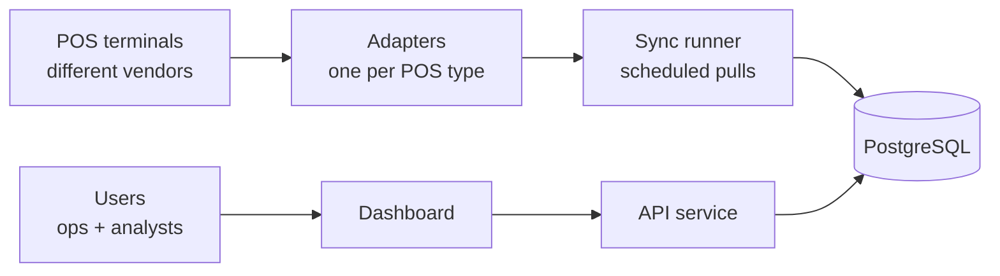
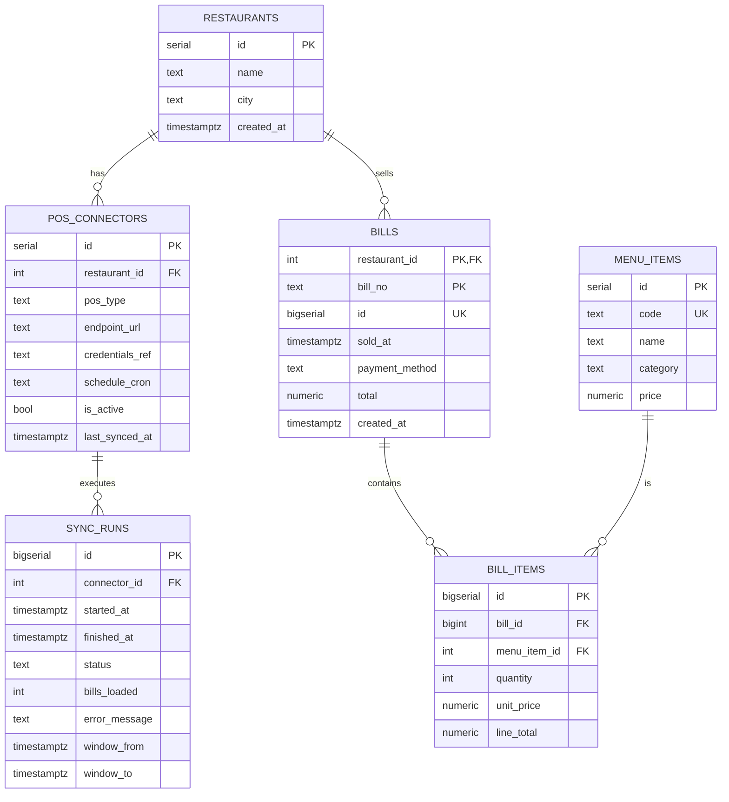
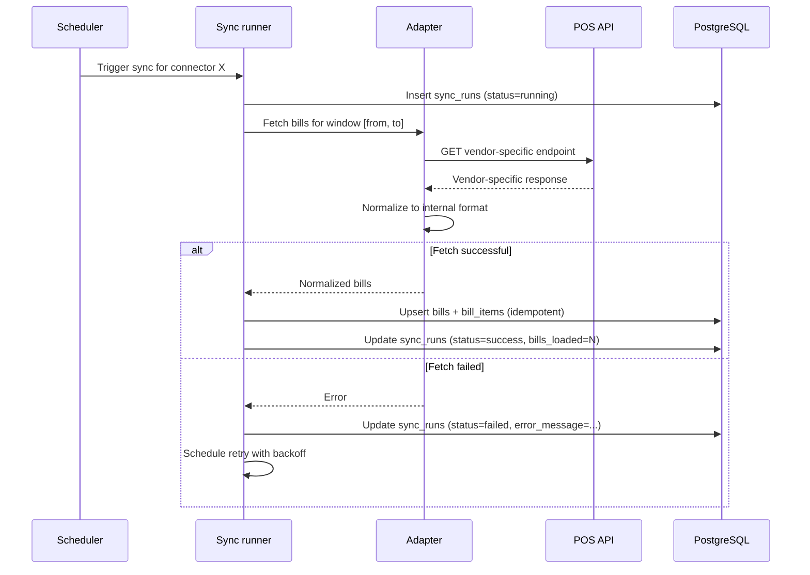

# Restaurant Chain Analytics Platform — PRD

**Status:** Draft (v0.2 — POS API integration)
**Owner:** Shamil
**Last updated:** 2026-05-01

---

## 1. Summary

We operate a restaurant chain across multiple locations. Each restaurant runs its own POS terminal, but the chain has not standardized on a single vendor — restaurants use different POS systems, each with its own API. Today there is no centralized view of chain-wide sales, so questions like "what's our best-selling dish?", "when do we get hammered on Saturdays?", and "how does Restaurant A compare to Restaurant B?" require manual work or go unanswered.

This project builds a small platform that pulls bill data from each restaurant's POS API on a schedule, normalizes the per-vendor response shapes into a single internal format, persists the result to PostgreSQL, and exposes a dashboard that answers the three questions above.

The system is intentionally simple in V1: scheduled pulls (no streaming), one chain-wide menu catalog (no per-location overrides), single currency, no forecasting. The goal of V1 is to give the chain a single source of truth for sales, not to build a full BI platform.

---

## 2. Goals and non-goals

### Goals

- Automated, scheduled ingestion of bill data from each restaurant's POS API
- Single source of truth for chain-wide sales data in PostgreSQL
- Answer three core questions: best-selling items, peak hours, restaurant comparisons
- Tolerate POS API failures gracefully (retry, backfill, monitor)
- Make it easy to onboard a new POS vendor by writing one adapter

### Non-goals (V1)

- Real-time / streaming ingestion — scheduled batch pulls match how POS APIs typically expose data
- Writing back to POS systems — read-only integration only
- Replacing or competing with the POS systems themselves
- Inventory, supply chain, or staff scheduling
- Customer-facing features (loyalty, reservations, online ordering)
- Forecasting or ML predictions (V2 candidate)
- Multi-currency
- Native mobile apps

---

## 3. Users

There are three user types.

**Operations team** sits at HQ and is responsible for the health of the data pipeline. They watch connector status across the chain, investigate failed sync runs, and follow up with restaurants when a POS connector has been down for a while. The previous version of this PRD had this team chasing missing Excel uploads — that role is replaced with monitoring connector health, which is more passive and dashboard-driven.

**Analysts and executives** consume dashboards to make decisions about menu, pricing, staffing, and which locations need attention. They query the unified data without caring which POS each restaurant runs.

**System admin** is a small role (often the same person as the operations lead) who onboards new restaurants by configuring a POS connector — picking the adapter type, entering the endpoint URL, registering credentials in the secret store, and setting the schedule.

Note that restaurant managers are no longer active users in V1. They continue running their POS terminals as before; the platform reads from those POSes without their involvement.

---

## 4. Functional requirements

| ID | Requirement |
|----|-------------|
| F1 | System fetches bills from each restaurant's POS API on a configurable schedule |
| F2 | Each POS vendor has a dedicated adapter that normalizes responses to the internal bill format |
| F3 | Re-running a sync does not duplicate data (idempotent on bill identity) |
| F4 | If a sync window fails, the system retries with backoff and surfaces persistent failures |
| F5 | Operations team can see the latest sync status per restaurant in one view |
| F6 | Operations team can see sync run history (success/failure, rows loaded, errors) |
| F7 | Analyst can view best-selling menu items, filterable by restaurant and date range |
| F8 | Analyst can view bill volume and revenue by hour of day, per restaurant or chain-wide |
| F9 | Analyst can compare KPIs (revenue, ticket size, items sold) side-by-side across restaurants |
| F10 | Admin can configure a new POS connector (vendor type, endpoint, credentials reference, schedule) |
| F11 | Admin can pause and resume an individual connector without deleting it |
| F12 | Admin can manage the menu catalog and restaurant records |
| F13 | Admin can manage user access |
| F14 | Raw POS API responses are retained for audit and reprocessing |

---

## 5. Architecture

The system has six logical components: the external POS terminals, an adapter layer, a sync runner, the database, an API service, and the dashboard.



The **adapter layer** is the heart of this design. Each POS vendor exposes a different API — different endpoints, auth schemes, response shapes, pagination strategies, time-zone conventions. We hide all of that behind a uniform internal contract: an adapter takes `(restaurant, time_window)` as input and returns a list of normalized bills with line items. Adding a new POS vendor means writing one adapter; the rest of the pipeline is untouched.

The **sync runner** is the orchestrator. On a schedule (default hourly, configurable per connector), it picks the right adapter for each restaurant's connector configuration, asks for bills in the next time window, and writes the result to PostgreSQL. Each run is recorded in a `sync_runs` row so operations can audit what happened, when, and whether it succeeded. The sync runner also handles retry with backoff when a POS API is briefly unavailable.

**PostgreSQL** is the cleaned, normalized data store. It holds the analytical data (bills, items, menu) plus the operational data (connectors, sync runs).

The **API service** owns authentication and the read path: dashboard queries, connector status, sync history. It is intentionally separate from the sync runner so that a slow analytical query can never starve the ingestion path.

The **dashboard** is a web app for operations (sync health) and analysts (charts and KPIs). It reads only from the API service.

Raw POS responses are persisted to object storage (not shown in the diagram for clarity) so we can replay against new adapter logic without having to re-fetch from the source.

### Tech stack (proposed)

The stack is open to discussion but a reasonable starting point is Python with FastAPI on the backend, PostgreSQL 15 or later as the database, AWS Secrets Manager (or HashiCorp Vault) for POS credentials, S3 or MinIO for object storage of raw API responses, a cron-style scheduler such as APScheduler or a managed runner like AWS EventBridge, and React with Recharts for the dashboard. Each adapter is a simple Python module implementing a small interface.

---

## 6. Data model

The core analytical schema (restaurants, menu items, bills, bill items) carries over from V1 unchanged. Two new operational tables support the POS integration: `pos_connectors` holds per-restaurant connector configuration, and `sync_runs` records every scheduled execution.



A few design notes.

The `bill_items.unit_price` is captured at sale time, not read from `menu_items.price`. If a price changes next month, last month's reported revenue does not silently move.

The `bills` table has `UNIQUE (restaurant_id, bill_no, sold_at)`, which makes the pipeline idempotent. Scheduled pulls overlap by design (we re-fetch the last hour or two on every run to catch late arrivals), so the same bill will be presented to the loader more than once. The unique constraint turns duplicate inserts into no-ops.

The `pos_connectors.credentials_ref` is a *pointer* to the secret store, never the secret itself. POS API keys are sensitive, and a Postgres column is the wrong place for them — anyone with read access to the table would have read access to every restaurant's POS.

The `sync_runs.window_from` and `window_to` columns let us reconstruct exactly which time range was pulled, which matters for backfill and for diagnosing "we missed bills between 14:00 and 15:00 on Tuesday".

---

## 7. Sync flow



Each sync intentionally pulls a window slightly larger than the schedule interval — for example, an hourly schedule pulls the last 90 minutes. This guarantees that bills closed near a window boundary are not missed, and the unique constraint absorbs the duplicate inserts. Backfill works the same way: an admin requests "re-sync restaurant X for date D", the sync runner pulls a 24-hour window, and idempotency does the rest.

When a POS API is unavailable, the sync run is marked `failed` with the error message preserved, and the runner schedules a retry. After repeated failures the connector is flagged for operations attention, but the system never silently gives up — the next scheduled window is always attempted fresh.

---

## 8. Non-functional requirements

V1 should comfortably handle ten restaurants doing about 500 bills per day each, which is roughly 5,000 bills and 25,000 line items per day distributed across hourly pulls. PostgreSQL on modest hardware does not break a sweat at that scale, and the per-pull volume is small (typically dozens of bills per restaurant per hour at peak).

Dashboard queries should return in under two seconds for the 90th percentile. With proper indexes on `(restaurant_id, sold_at)` and `bill_id`, the standard analytical queries are sub-second on a year of data.

Reliability rests on three things: idempotent inserts (covered by the unique constraint), retry-with-backoff on POS API failures (handled by the sync runner), and raw response retention in object storage so we can replay if adapter logic changes or a bug is found.

POS credentials live in a managed secret store, never in the database or in code. The `pos_connectors.credentials_ref` column holds only an opaque identifier. Adapter code resolves the reference at sync time.

Authentication is required for all dashboard and admin endpoints. Operations and analysts have read access to all restaurants. Admins have write access to connector configuration and reference tables. There is no per-restaurant view restriction in V1, since restaurant managers are no longer system users.

---

## 9. Milestones

**M1 — Schema and one adapter end-to-end.** Three weeks. Goal: a developer can run a script that pulls bills from one specific POS vendor and lands them in Postgres. No scheduler yet, no UI. This proves out the schema, the adapter contract, and the idempotency model.

**M2 — Adapter framework and scheduled runs.** Four to five weeks. Goal: at least three adapters covering the chain's POS vendors, plus the scheduler, plus an operational dashboard view showing connector status and sync history. The pipeline runs unattended.

**M3 — Analytics dashboard.** Three weeks. The three core views: best sellers, peak hours, restaurant comparison, with date-range and restaurant filters.

**M4 — Admin UI and production polish.** Three weeks. Connector configuration UI (so admins don't edit Postgres directly), menu management, user access management, alerts on persistent connector failures.

---

## 10. Open questions

There are several decisions worth resolving before we start building, all of which affect adapters or the sync logic.

How frequently should we pull? Hourly is a sensible default but each POS vendor may have rate limits or recommend a specific cadence. We may also want a different cadence per restaurant size — a high-volume location may justify pulling every 15 minutes.

How does each POS API expose voids and refunds? Negative quantity lines? A separate "void" bill referencing the original? A `cancelled` flag on the original bill? This is the question most likely to differ between vendors and most likely to bite us if we get it wrong.

How does each POS API handle pagination and time-window queries? Some return all bills in a window; others paginate and require us to walk pages. The adapter abstraction handles this internally, but we need to know the contract for each vendor before estimating that adapter's complexity.

How should we handle a POS that's been down for an extended period (a full day, a weekend)? Auto-backfill on recovery, or require an admin to trigger backfill explicitly? The latter is safer (no surprise mass-inserts) but more operational toil.

Do the POS APIs export the menu catalog as well? If yes, we should sync menu items automatically too rather than maintaining the catalog manually. If different POSes have different menu structures, we may need a separate menu-sync flow.

How are time zones reported? Each POS may return timestamps in UTC, in local time, or in some vendor-specific convention. Adapters must normalize to UTC before handing data to the loader.

---

## 11. Risks

The biggest risk in this architecture is **POS API instability**. Vendor APIs change their response shapes without notice, deprecate endpoints, throttle unexpectedly, or simply go down. Mitigation: keep raw responses in object storage so we can diff and replay; alert aggressively on schema validation failures rather than silently dropping bad bills; design adapters to fail loudly and isolate the blast radius to one connector.

A close second is **credential management**. POS API keys are bearer tokens to a restaurant's revenue data — leaking them is a serious incident. Mitigation: never store credentials in the database or in code; use a managed secret store; rotate on a schedule; audit access to the secret store separately from access to the database.

**Adapter quality drift** is a slower-moving risk. As we add more vendors, the temptation to special-case behavior in the sync runner ("if vendor is Toast, do X") will grow. That destroys the abstraction that makes the rest of the pipeline simple. Mitigation: enforce that all vendor-specific logic lives in adapter code, with reviews on PRs that touch the sync runner or the loader.

**Vendor coverage gap** is worth flagging early. If the chain adds a restaurant on a POS for which we have no adapter, that restaurant is invisible to the platform until we ship the adapter. We should track the list of supported POS types explicitly and treat it as a roadmap input.

---

## 12. Appendix: SQL DDL

The base schema (restaurants, menu_items, bills, bill_items) lives in `restaurant_chain_schema.sql`. The two operational tables added in this revision:

```sql
CREATE TABLE pos_connectors (
    id              SERIAL PRIMARY KEY,
    restaurant_id   INT  NOT NULL REFERENCES restaurants(id),
    pos_type        TEXT NOT NULL,                 -- 'lightspeed', 'toast', 'square', ...
    endpoint_url    TEXT NOT NULL,
    credentials_ref TEXT NOT NULL,                 -- pointer to secret store, never the secret
    schedule_cron   TEXT NOT NULL DEFAULT '0 * * * *',
    is_active       BOOLEAN NOT NULL DEFAULT TRUE,
    last_synced_at  TIMESTAMPTZ,
    created_at      TIMESTAMPTZ NOT NULL DEFAULT now(),
    UNIQUE (restaurant_id, pos_type)
);

CREATE TABLE sync_runs (
    id              BIGSERIAL PRIMARY KEY,
    connector_id    INT  NOT NULL REFERENCES pos_connectors(id),
    started_at      TIMESTAMPTZ NOT NULL DEFAULT now(),
    finished_at     TIMESTAMPTZ,
    status          TEXT NOT NULL DEFAULT 'running'
                    CHECK (status IN ('running','success','failed','partial')),
    bills_loaded    INT NOT NULL DEFAULT 0,
    error_message   TEXT,
    window_from     TIMESTAMPTZ,
    window_to       TIMESTAMPTZ
);

CREATE INDEX ix_sync_runs_connector ON sync_runs (connector_id, started_at DESC);
CREATE INDEX ix_sync_runs_status    ON sync_runs (status) WHERE status <> 'success';
```
